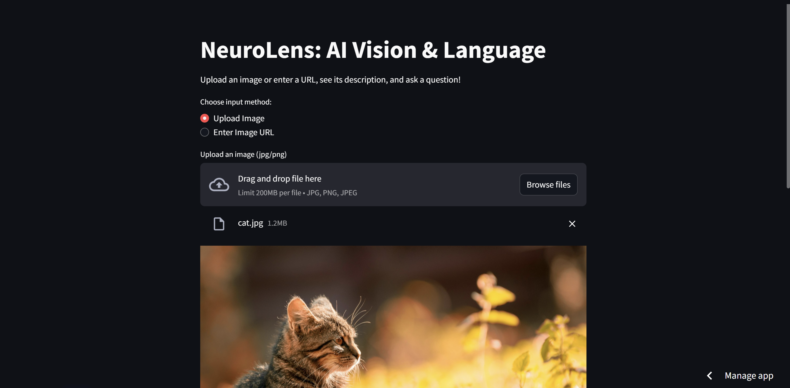
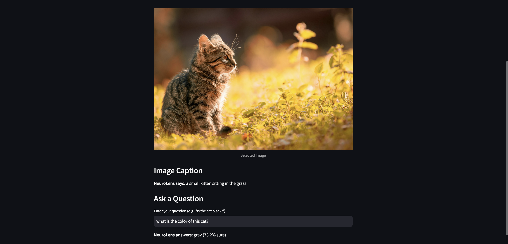

# 🧠 NeuroLens: AI Vision & Language

**NeuroLens** is a lightweight AI system that understands images and answers questions about them — all in one flow! Built with 🐍 Python and powered by 🤗 Hugging Face Transformers, it runs seamlessly on **Google Colab**.

---

## ✨ Features

- 🖼️ **Image Captioning**  
  Automatically describes images.  
  _Example: “A cat on a couch.”_

- ❓ **Visual Question Answering (VQA)**  
  Answers natural-language questions about images.  
  _Example: “Is the cat black?” → “Yes.”_

---

## 🚀 How to Run

Open Google Colab.
Install dependencies:
!pip install transformers pillow requests

Copy neurolens.py into a Colab cell.
Run and follow prompts: upload an image or enter a URL, then ask a question.

---

## 🧪 Example
Image: Cat (URL: https://images.unsplash.com/photo-1561948955-570b270e7c36).

Caption: “A cat sleeping.”

Question: “Is the cat black?”

Answer: “Yes (92% sure).”

---

## 🔍 Demo

Here's how the text recognition works on a sample image:

---

🛠️ Built With
Hugging Face Transformers

Python

Google Colab

---

## 🚧 Next Steps
🤖 Add a conversational chatbot interface

🧠 Integrate reinforcement learning for smarter Q&A

🌐 Deploy as a full-stack web app

---

👩‍💻 Author
Made with ❤️ by Hansha
